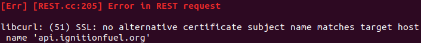
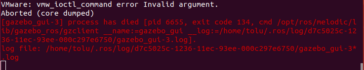
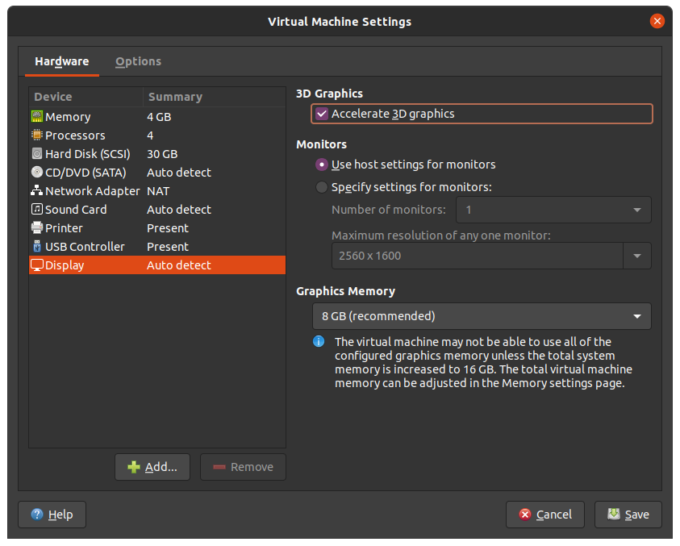

# Gazebo Troubleshooting Guide 

This is a collection of commonly encountered Gazebo errors and fixes.

## Error in REST request


If Gazebo fails to launch and gives the above error. Press Ctrl-c to kill the process.

To fix this error you need to change a url in the ignition config.yaml
```bash
gedit .ignition/fuel/config.yaml
```
This will open a file which looks like this:
```bash
---
# The list of servers.
servers:
  -
    name: osrf
    url: https://api.ignitionfuel.org

  # -
    # name: another_server
    # url: https://myserver

# Where are the assets stored in disk.
# cache:
#   path: /tmp/ignition/fuel
```
Comment out the line below with a hash
```
# url: https://api.ignitionfuel.org
```
And add the new url:
```
url: https://api.ignitionrobotics.org
```
Save the new file and exit the text editor. Now when you relaunch a Gazebo world the error
should be gone. If not double check the file you just edited for typos.

## VMware: vmw_ioctl_command error Invalid argument.
This error has something to do with the way VMPlayer handles graphics acceleration. You will see this:


To fix the error, properly shutdown the virtual machine either using the shutdown menu or by
entering into the terminal:
```
poweroff
```
Relaunch VMPlayer, right click on the name of your virtual machine and select Virtual
Machine Settings.

In the Hardware Options tab, under Display, uncheck Accelerate 3D Graphics.
Save the changes and exit. 

**Note** You may be unable to change the VMPlayer settings if the virtual machine has not
been completely powered off. When this is the case all of the options will be greyed out.
Make sure have you completely shutdown the virtual machine.

When you boot back into your virtual machine you should now be able to launch a Gazebo
world.

An alternative fix is to leave hardware acceleration on and allocate more graphics memory.
This depends on how much available graphics memory your system has.
