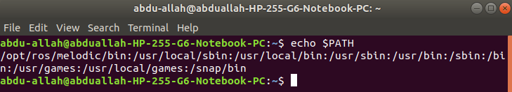
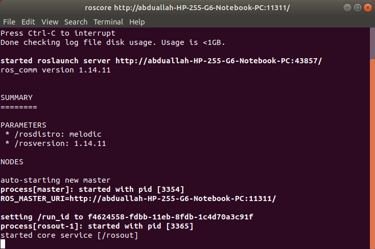

Disclaimer: Many links to external sites, such as youtube and other online guides, will be used. These were not created by the creators of this guide.

This is part 2 of a 4 part series going through the installation and application of Linux and the robotic operating system(ROS). These documents were created by Toluwani Soboyejo, Abdu-Allah Awad and Jessica Paterson. If you find mistakes in the documents please let us know so changes can be made.

# Installing ROS onto Linux

## Concepts To Understand
### Terminals 

Pressing **Ctrl+Alt+T** will open a window,similar to the command prompt used in Windows, called the **terminal**.
* **Terminal** - acts as a visual interface whereby you type in the commands into the terminal and see the output through that terminal. 
* **Shell** - is the software behind the terminal that interprets the commands and executes them into the operating system services.
* **Bash** - is a particular type of shell which is referred to in some tutorials - another one is **zsh** however, for the purpose of these tutorials, we will stick to the default bash. 

### ROS "Distributions" 

The different versions of ROS are called **distributions**. Each successive version of ROS is given a different name and the first letter of that name changes alphabetically with each new distribution (version). For more info on this topic, read up on the different distributions at this link: 
http://wiki.ros.org/Distributions

The distribution we are using is **ROS Melodic** as this is most commonly used here in Manchester and it is one of the most stable. 

## Installing ROS Melodic onto Linux
Now that you have Linux up and running, you need to download ROS. To begin this process you will need to open the Terminal by pressing **Ctrl+Alt+T**. Follow the instructions below to install Linux. **Bear in mind:** Some commands require a password. When typing your password, it will appear as if you are not typing anything into the terminal but, in fact, it is taking in the input of your keys. Carefully put in your password and click Enter.

To download ROS you will need the following commands, you can copy commands and paste them in the terminal using Ctrl+Shift+V.

### 1. Setup your sources.list
Setup your computer to accept software from packages.ros.org. 
```
sudo sh -c 'echo "deb http://packages.ros.org/ros/ubuntu $(lsb_release -sc) main" > /etc/apt/sources.list.d/ros-latest.list'
```
### 2. Set up your keys
```
sudo apt install curl # if you haven't already installed curl
```
```
curl -s https://raw.githubusercontent.com/ros/rosdistro/master/ros.asc | sudo apt-key add -
```
### 3. Installation
First, make sure your Debian package index is up-to-date: 
```
sudo apt update
```
Desktop-Full Install: ROS, rqt, rviz, robot-generic libraries, 2D/3D simulators and 2D/3D perception
```
sudo apt install ros-melodic-desktop-full
```
To find available packages, use: 
```
apt search ros-melodic
```
### 4. Environment setup
In order to use ROS commands, you need to make sure that the shell knows where to find the ROS commands are (imagine it like inserting a library at the beginning of writing your code). 

It's convenient if the ROS environment variables are automatically added to your bash session every time a new shell is launched, the following commands will ensure this: 
```
echo "source /opt/ros/melodic/setup.bash" >> ~/.bashrc
```
```
source ~/.bashrc
```
_If you have more than one ROS distribution installed, ~/.bashrc must only source the setup.bash for the version you are currently using._

* Be aware that that if you mistype this command, you may have some unintentional outocmes:
  * The >> here means that it will append to (add to) the .bashrc file. Only using > is incorrect.
  * The .bashrc file is the file that the shell automatically refers to when searching for the commands that you type into the terminal
  * Missing the dot in the .bashrc part will simply lead to you creating a new text file called bashrc in your home folder. This is not what you are intending for.

If you just want to change the **environment of your current shell**, instead of the above you can type:
```
source /opt/ros/melodic/setup.bash
```

## Checking that you have ROS installed correctly

*  You can check that you have completed section 1.5 correctly by typing the following into a new command terminal:
```
echo $PATH 
```
  * If set up correctly then the outcome should be something similar to: 




* Completing all the sections up to **Section 1.6** means that now you should have ROS downloaded. You can check this by typing out the following command in a new terminal:
```
roscore
```
  * The outcome of this should be as follows:


* Another thing to check is that the environment variables are correctly installed. To do this, type the following into a new command terminal:
```
printenv | grep ROS
```
  * The outcome of which should be:


## Installing some dependencies
 
 At this pouint, the last stage is to download some final dependencies that will allow you to some important ROS tools. 

 In a new terminal, type in the following commands:

 ```
 sudo apt install python-rosdep
 ```
 then type the following:
 ```
 sudo rosdep init
 ```
 then type the following:
 ```
 rosdep update
 ```

 The output of which should be the following:
 

 
