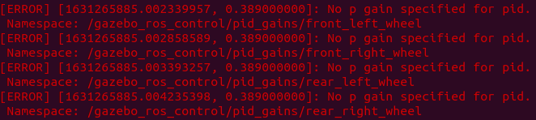
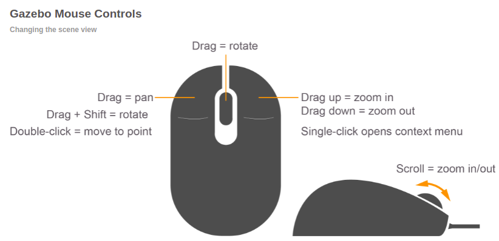
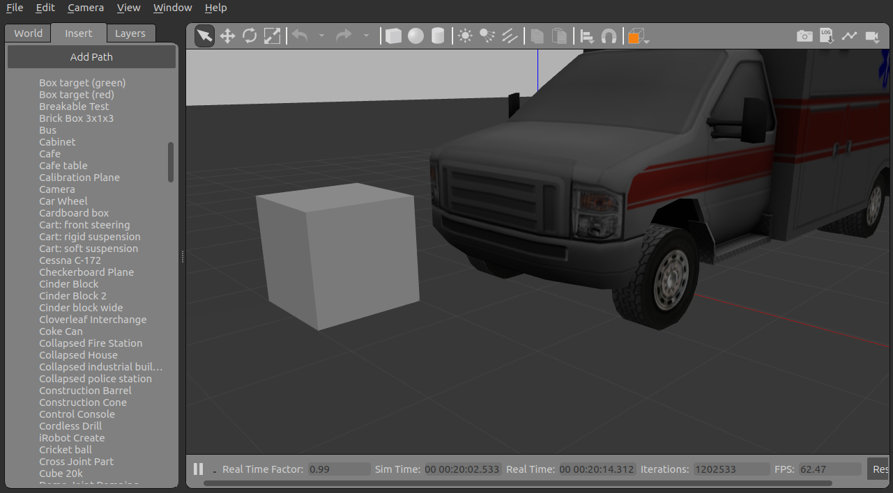
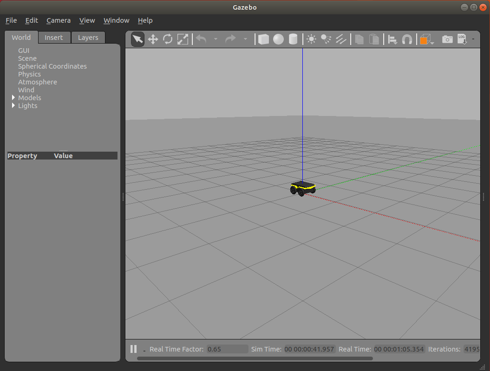

_Disclaimer: Many links to external sites, such as youtube and other online guides, will be used. These were not created by the creators of this guide._

**This is part 3 of a 4 part series going through the installation and application of Linux and the robotic operating system(ROS). These documents were created by Toluwani Soboyejo, Abdu-Allah Awad and Jessica Paterson. If you find mistakes in the documents please let us know so changes can be made.**

# Beginner - Running a Robot

In this part of the guide you will get the chance to use "Gazebo" to simulate the movement of a 4 wheeled robot (**Husky**). Gazebo is a program that uses a physics engine to give an accurate simulation of robots in an environment. After installing the required files you will be able to open Gazebo, simulate robot movement and control the robot movement. Additionally, there is some guidance for using the Gazebo software as well as a practice example to help understanding. Finally, for the more studious of you, there is an explanation for the commands you will be using during the installs to help you yo get used to the ROS.

## Concepts to understand

### ROS Master, Node and Topics
To have a good understanding of how ROS works, you need to have a brief understanding of what the ROS Master, Node and Topic is.

**ROS Master:** the central unit which allows for all nodes to locate each other and connect to each other.

**Node:** the simplest unit of processing in ROS that. It has one purpose and can be viewed as a single executable programme 

**Topic:** a node sends messages by subscribing or publishing to a topic. A topic has a name and it has a type.

This can be summed up in the following analogy. You are in a room (ROS Master) with lots of other people (nodes). When you decide to speak, you will speak about a particular subject (publishing to a topic) and you will also speak in  a particular language (message type). Other people (nodes) can then decide to listen in on what you are saying (by subscribing to that topic using topic name and type) and then act upon the information.

**Gazebo:**  a program that uses a physics engine engine to give an accurate simulation of robots in an environment.

**Package:** a folder/archive that has all the files for a particular application.


## Getting a Robot up and Running

### 1. Install Robot

Let's attempt to install a virtual industrial robot from Clearpath Robotics. Firstly, enter the following commands in a new terminal (if you are on a computer simply click on the clipboard to the right of the code box, after hovering over it, to copy the contents). **Use a lowercase 'y' to accept the installs** when asked in the terminals.

```
sudo apt-get update
```
```
sudo apt-get install -y ros-melodic-husky-desktop ros-melodic-husky-simulator
```
### 2. Launch Gazebo

At this point, you have downloaded a "husky" robot from Clearpath Robotics. Now enter the following comand:
```
roslaunch husky_gazebo husky_empty_world.launch
```
*The command **roslaunch** allows for multiple nodes to be started up. This commands requires for the package name (in this case it is **husky_gazebo**) and a launch file (**husky_empty_world.launch**).*

You will get the error below upon running the line above, this is completely normal!:


However if you get additional errors, we have noted the errors we found and suitable fixes for them at this link [Known Errors](GazeboErrors.md). We have found that you will likely have these additional error if you chose the **virtual machine route**.

The following window should appear:


In front of you is the Gazebo program with a robot spawned into an empty world. **You must ensure the terminal you used to launch Gazebo is left open, to stop Gazebo from closing**. You can minimize the terminal to keep it out of the way. 

### 3. Using the Gazebo Program

In Gazebo, you have a few different things that you can do.

1) You can navigate the 3D view port by using the mouse as shown in the following picture:



*Sourced from http://gazebosim.org/hotkeys.html*

2) You should be able to see a bar ontop of the 3D viewport in Gazebo, as shown below. Each of these icons have different roles and a corresponding keyboard shortcut, which is further described below (from left to right).

    * Selection mode icon (shaped as a mouse) allows you to select objects and move the screen. It's shortcut is **Esc**.
    * Translation Mode icon (cross shaped) allows you to move the object. It's shortcut is **T**.
    * Rotation Mode icon allows you to rotate the object. It's shortcut is **R**.
    * Scale Mode icon allows you to scale the object. It's shortcut is **S**.
    * The next two icons are the undo and redo buttons.
    * The following three icons are to insert objects should you wish to do so.
    * The Next three icons give you 3 ways to change the lighting. 
    * The two icons that follow this are the 'copy' and 'paste' options.
    * Next is the align tool that allows you to select 2 object you want to be aligned with each other.
    * Then the Snap mode icon.
    * The following cube icon is the perception tool this enabling you to view the port from any side and to view the objects in either perspective mode or orthographic mode.
    * The last four options enables you to take a screenshot (picture of the world), log results, plot data and record a video of the simulation (mp4 option included).
    
    Some of the keyboard shortcuts to change mode have been identified above, however there is a more complete list at **Help** > **Hotkey Chart** in the Gazebo program. 

3) In Gazebo, you can insert different objects from a given library. In the left hand pane, navigate the mouse to 'insert' and underneath you will see links to stores that have an array of models that you can insert



### 4. Move the Robot with Software
In a new a terminal, type the following command:

```
rostopic pub /husky_velocity_controller/cmd_vel geometry_msgs/Twist "linear:
        x: 0.5
        y: 0.0
        z: 0.0
angular:
        x: 0.0
        y: 0.0
        z: 0.0" -r 10
```
***"rostopic pub"** is a specific command to do with topics in ROS. As the name suggests it publishes a message of type /husky_velocity_controller/cmd_velgeometry_msgs/Twist  and the message is from "**linear**..." onwards.*

You should see the robot simulation in your Gazebo window move forward. Within the Gazebo window you should be able to move the screen positioning by left clicking and dragging. To stop the robot moving, return to the terminal and press **Ctrl+C**. **Warning: the command lines above will only work if an instance of Gazebo has already been opened.**

*Pressing **Ctrl+C** whilst in a terminal causes the process to be killed off. In this instance, you are stopping the message from being published to the robot telling it to move.*

Once you have stopped the movement press **Ctrl+r** (while on Gazebo) to reset the world to its original state.

### 5. Take control of the Robot
after pressing **Ctrl+C** or reopening the terminal, enter the following command:
```
sudo apt-get install ros-melodic-teleop-twist-keyboard
``` 
_This package allows you to operate the virtual husky using the input from your keyboard to publish to the twist topic as opposed to you typing out the message like in the previous example._

If you have the **"husky robot"** up and running in Gazebo, you can now open another terminal and enter:
```
rosrun teleop_twist_keyboard teleop_twist_keyboard.py
```
*The command **rosrun** is used to run a single node. It is followed by the package name that it is supposed to locate (**teleop_twist_keyboard**) and then the node code (in this case it is the python code **teleop_twist_keyboard.py**).*

You should be able to see the following output:


At this point, you can use your keyboard to control the husky simulation using the keys noted above. The keys **"u"**, **"i"**, **"o"**, **"j"**, **"k"**, **"l"**, **"m"**, **","** and **"."** control the movement of the Robot, while **"q/z"**, **"w/x"** and **"e/c"** increase and decrease speed in 3 different ways respectively, as seen in the image above. **You will be able to use the controls while this terminal is open**.

## Tutorial Exercises

1) Download a **Jackal Robot** and launch it in an empty world

Hint: you can download the jackal by entering the following commands in the terminal
```
sudo apt-get update
```
```
sudo apt-get install -y ros-melodic-jackal-desktop ros-melodic-jackal-simulator
```
The name of the package is jackal_gazebo and the launch file is called empty_world.launch. _Hint: look at how we launched Gazebo in **part 2** of **"Getting a Robot up and Running"**_

You should see this when Gazebo opens:


2) Navigate the Jackal Robot around, from your keyboard. 
_Hint: The same package that was used in **part 5** of **"Getting a Robot up and Running"**_

3) Using simple objects, create a course for the Jackal robot to move around the course

# Tips and Tricks

After typing the following line of code in **without pressing enter** you are able to auto fill the rest by pressing **Tab**:
```
roslaunch husky_gazebo
```
If you press tab now you will get a list of all the available worlds. We suggest trying to launch husky_playpen.launch. **Warning: it may take a while to launch, especially inside a virtual machine**

*Generally in a Linux terminal, you can type in part of a command and then press the **Tab** key to autofill the command if it is long.*
