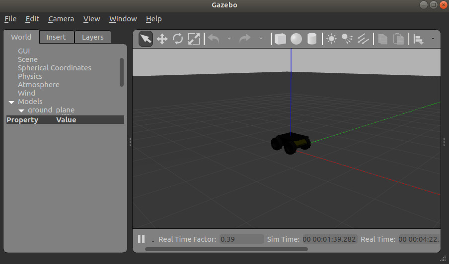
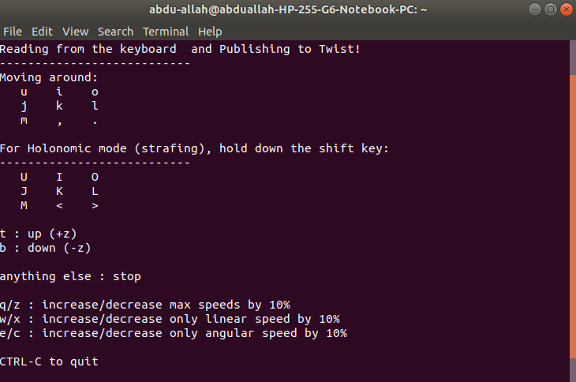

# Beginner - Running a Robot


## Concepts to understand

### ROS Master, Node and Topics
To have a good understanding of how ROW works, you need to have  a brief understanding of what the ROS Master, Node and Topic is.

**ROS Master:** the central unit which allows for all nodes to locate each other and connect to each other.

**Node:** the simplest unit of processing in ROS that. It has one purpose and can be viewed as a single executable programme 

**Topic:** a node sends messages by subscribing or publishing to a topic. A topic has a name and it has a type.

This can be summed up in the following analogy. You are in a room (ROS Master) with lots of other people (nodes). When you decide to speak, you will speak about a particular subject (publishing to a topic) and you will also speak in  a particular language (message type). Other people (nodes) can then decide to listen in on what you are saying (by subscribing to that topic using topic name and type) and then act upon the information.

**Gazebo:**  a program that uses a physics engine engine to give an accurate simulation of robots in an environment.

**Package:** a folder/archive that has all the files for a particular application.


## Getting a Robot up and Running

Let's attempt to install a virtual industrial robot from Clearpath Robotics.

In a new terminal enter the following commands:

```
sudo apt-get update
sudo apt-get install ros-melodic-husky-desktop
sudo apt-get install ros-melodic-husky-simulator
```
*The command **sudo apt-get update** updates all the package informations. The two commands following it are to install the husky simulator*

At this point, you have downloaded a husky robot from Clearpath Robotics.

In a new terminal, enter the following comands:

```
roslaunch husky_gazebo husky_empty_world.launch
```

*The command **roslaunch** allows for multiple nodes to be started up. This commands requires for the package name (in this case it is husky_gazebo) and a launch file (husky_empty_world.launch)*
 
 The following window should appear:

 

In front of you is the Gazebo program with a robot spawned into an empty world. Gazebo is a program that uses a physics engine to give a accurate simulations of robots in an environment.

In a new a terminal, type the following command **but don't press enter**:

```
rostopic pub /husky_velocity_controller/cmd_vel geometry_msgs/Twist
```
*Generally in a Linux terminal, you can type in part of a command and then press the **Tab** key to autofill the command if it is long. This is what we are going to do in this case*

At this point press the **Tab** key and the terminal should auto fill with additional text and lines. Adapt the command line for the x variable such that the whole command line looks like the following:

```
rostopic pub /husky_velocity_controller/cmd_vel geometry_msgs/Twist "linear:
        x: 0.5
        y: 0.0
        z: 0.0
angular:
        x: 0.0
        y: 0.0
        z: 0.0" -r 10
```
** "rostopic pub" is a specific command to do with topics in ROS. As the name suggests it publishes a message of type /husky_velocity_controller/cmd_velgeometry_msgs/Twist  and the message is from "linear..." onwards*


Once you have pressed enter, you should see the robot simulation in your Gazebo window move forward. 

Within the Gazebo window you should be able to drag the robot by left clicking and dragging.

To stop the robot moving, return to the terminal and press **Ctrl+C**. 

*Pressing **Ctrl+C** whilst in a terminal causes the process to be killed off. In this instance, you are stopping the message from being published to the robot telling it to move*

Exit the terminal and, in a new terminal, enter the following command:
```
sudo apt-get install ros-melodic-teleop-twist-keyboard
``` 
*This package allows you to operate the virtual husky using the input from your keyboard to publish to the twist topic as opposed to you typing out the message like in the previous example*

If you have the husky up and running in Gazebo, you can now open another terminal and enter:
```
rosrun teleop_twist_keyboard teleop_twist_keyboard.py
```
*The command **rosrun** is used to run a single node. It is followed by the package name that it's supposed to locate (teleop_twist_keyboard) and then followed by the node code (in this case it is the python code teleop_twist_keyboard.py)*

You should be able to see the following output:


At this point, you should be able to use your keyboard to control the husky simulation using the keys noted above.

## Using Gazebo Program

In Gazebo, you have a few different things that you can do.

1) You can navigate the 3D view port by using the mouse as shown in the following picture:


*Sourced from http://gazebosim.org/hotkeys.html*

2) You should be able to see a bar ontop of the 3D viewport in Gazebo as shown:

* The first four options are tools to inteact  with objects in the 3D environment. The mouse to select objects and, once selected, using the other three tools to either move, rotate or scale the object.
* The next two options are the previous and forward buttons
* The next three options are to insert objects should you wish to do so
* The following three options are concerned with how the light is rendered (you don't need to worry about that now)
* The two options that follows are the 'copy' and 'paste' options should you wish to copy and paste objects 
* The two options following this is the allign and magnet tool
* The following cube icon is the perception tool this enabling you to view the port from any side and to view the objects in either perspective mode or orthographic mode
* The last four options enables you to take a screenshot (picture of the world), log results, plot stuff and record a video of the simulation (mp4 option included)

3) In Gazebo, you can insert different objects from a given library. In the left hand pane, navigate the mouse to 'insert' and underneath you will see links to stores that have an array of models that you can insert


## Tutorial Exercises

1) Download a **Jackal Robot** and launch it in an empty world

Hint: you can download the jackal by entering the following commands in the terminal
```
sudo apt-get update
sudo apt-get install ros-melodic-jackal-desktop
sudo apt-get install ros-melodic-jackal-simulator
```
The name of the package is jackal_gazebo and the launch file is called empty_world.launch

2) Navigate the Jackal Robot around, from your keyboard. 
Hint: The same package that 

3) Using simple objects, create a course for the Jackal robot to move around the course
